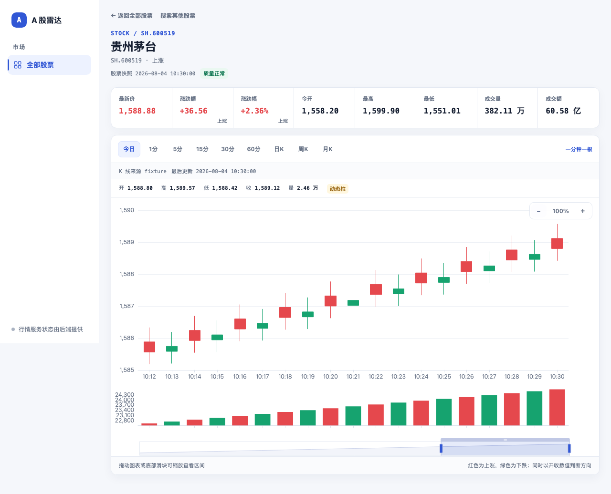

# A 股雷达

A 股雷达是一套本地运行的 A 股行情研究工具。当前聚焦两个页面：全部股票列表，以及支持今日、1/5/15/30/60 分钟、日 K、周 K、月 K 的个股详情页。左侧当前只保留“全部股票”一个菜单，一只股票固定占一行，支持按股票代码或名称搜索。详情页可直接搜索并切换其他股票，同时展示昨收、换手率、总市值和后端统一判定的开闭市状态。



截图展示贵州茅台详情页的今日视图；“一分钟一根”表示每根蜡烛对应上游返回的一分钟原生 K 线，图表支持加号、减号、滚轮、拖动和底部滑块缩放。

## 技术指标

- 详情页的 MACD 与 KDJ 跟随当前 K 线周期切换，支持今日、1/5/15/30/60 分钟、日 K、周 K 和月 K；两个副图与主图共享十字轴和缩放区间。
- KDJ 固定使用标准 `9,3,3` 参数，以 K、D 的实际交叉识别金叉和死叉。副图使用 20、80 两条虚线划分超卖区、普通区和超买区，J 值允许超出 0 到 100。
- 列表页的 MACD 与 KDJ 筛选只使用日 K 结果；KDJ 支持按金叉/死叉、低位/中位/高位和今日/近 3 日/近 5 日组合筛选。
- 开市期间，列表页和详情页在页面可见时每 60 秒静默刷新。详情页会同步更新当前周期的 K 线、MACD 与 KDJ；收盘时完成最后一次刷新后停止，单项刷新失败会保留上一次有效数据。

## 环境要求

- Python 3.12 或更高版本；
- Node.js 22 或更高版本；
- pnpm；
- macOS、Linux，或具备 Bash 环境的系统。

## 安装与启动

在项目目录执行：

```bash
./scripts/bootstrap.sh
./scripts/dev.sh
```

浏览器打开 <http://127.0.0.1:5173>。脚本可以从任意工作目录调用；例如：

```bash
/完整路径/A\ 股项目/scripts/dev.sh
```

如果只想离线查看确定性演示数据，不访问公网：

```bash
A_SHARE_FIXTURE_SOURCE=true ./scripts/dev.sh
```

离线演示默认写入 `data-fixture/`，不会混用在线模式的 `data/`。如果显式设置
`A_SHARE_DATA_DIR`，脚本会优先使用你指定的目录。

默认后端端口是 `8000`，前端端口是 `5173`。端口冲突时可临时指定：

```bash
A_SHARE_BACKEND_PORT=18000 A_SHARE_FRONTEND_PORT=15173 ./scripts/dev.sh
```

## 生产部署

生产环境采用 Docker Compose 运行后端和前端容器，宿主机 Nginx 按域名反向代理到
前端容器的本机端口。当前默认域名为 `astock.liufengliu.com`，服务器路径为
`/opt/a-share-analysis-assistant`，宿主机只监听 `127.0.0.1:18080`，公网不会直接暴露
后端容器端口。

部署到默认服务器：

```bash
./scripts/deploy_server.sh
```

如果要换服务器、目录或域名：

```bash
DEPLOY_HOST=root@47.94.3.250 \
DEPLOY_DIR=/opt/a-share-analysis-assistant \
DEPLOY_DOMAIN=astock.liufengliu.com \
./scripts/deploy_server.sh
```

部署脚本会同步代码、构建镜像、启动服务，并写入 Nginx 站点配置。如果服务器已存在该
域名的 Let’s Encrypt 证书，脚本会自动重新安装 HTTPS 跳转，避免后续部署覆盖 Certbot
配置。首次签发 HTTPS 证书前，需要先在 DNS 服务商处添加 A 记录：
`astock.liufengliu.com -> 47.94.3.250`。DNS 生效后可在本地执行：

```bash
DEPLOY_ENABLE_HTTPS=true ./scripts/deploy_server.sh
```

也可在服务器直接执行：

```bash
certbot --nginx -d astock.liufengliu.com
```

## 测试

后端全量测试、Ruff、前端组件测试和生产构建：

```bash
./scripts/test.sh
```

首次运行浏览器端到端测试，需要安装 Playwright Chromium：

```bash
cd frontend
pnpm exec playwright install chromium
pnpm e2e
```

端到端测试使用固定离线数据，启动时会写入贵州茅台、平安银行、招商银行、紫金矿业、赤峰黄金和宁德时代 6 只股票、当前快照、每只股票 60 根日 K 和 61 根当日一分钟 K；按需提供 5/15/30/60 分钟样本，并预计算列表使用的日 K MACD、KDJ。它不会启动公网采集调度器或后台历史回补任务。每次运行都由统一父级脚本新建独立系统临时目录，并直接管理 Uvicorn、Vite 和 Playwright 三棵进程树；三者完整退出且端口释放后才删除 DuckDB，不复用仓库数据，也不依赖上一次测试结果。验收会覆盖日 K KDJ 组合筛选、多周期指标切换、缩放与拖动，并模拟 1 分钟和 30 分钟新柱到达，确认 K 线、MACD、KDJ 与信号时间能在不刷新页面的情况下同步更新。

E2E 测试 runner 当前支持 macOS 和 Linux，Windows 尚未支持；这一平台边界只针对负责三棵进程树与临时目录生命周期的测试 runner，不限制产品前端或后端本身。Windows 上运行 Node 入口或直接运行 Python runner 都会在启动任何子进程、占用端口或创建临时目录之前，以固定中文说明并非零退出。

在线烟雾测试必须显式授权。它只读取一次 AKShare 全市场快照，不写数据库；除全市场数量与去重外，还会校验代表股票的必需字段、上海时区、有限正数 OHLC 及其关系、非负量额和成交量股口径：

```bash
A_SHARE_RUN_LIVE=1 backend/.venv/bin/python scripts/smoke_live.py
```

没有设置 `A_SHARE_RUN_LIVE=1` 时，脚本会用中文说明并退出，避免测试意外访问公网。

## 数据来源与更新语义

当前免费数据源是 AKShare 封装的公开行情接口。免费接口可能限流、超时、变更字段或临时不可用，因此系统采用“本地数据优先”：网络失败不会主动删除已经保存的数据，界面会通过最后更新时间和质量状态提示过期风险。

股票主数据从上交所、深交所和北交所的独立代码/简称/上市日期接口更新，不占用全市场实时快照请求；任一交易所主数据失败时，仓储中该市场已有的名称和上市日期保持不变。

全市场快照与原生分钟 K 必须区分：

- 全市场快照：交易时段内按一分钟周期抓取一批股票当前值，用于列表最新价、涨跌幅和统计；它是采集时刻的截面，不能冒充交易所的一分钟 OHLC K 线。
- 原生分钟 K：用户打开具体股票的分钟视图时，从上游分钟 K 接口获取，包含该分钟的开、高、低、收、成交量和成交额。

快照、日 K 和分钟 K 的 `volume` 统一以“股”为单位，`amount` 统一以“元”为单位。AKShare 上游返回的“手”会在数据源适配层乘以 100，固定演示数据也直接使用股口径，前端不再二次换算。

时间与质量字段使用以下统一语义：

- 快照 `captured_at`：整批全市场行情成功采集对应的数据时刻，包含上海时区；列表“更新时间”和详情“股票快照”均来自该字段。
- K 线 `bar_time`：这一根柱代表的市场时间；东财分钟 K 使用周期结束标签，并按上海市场上午、下午两段交易时段判断完成状态。`acquired_at` 是系统实际取得或确认该柱的采集时间，两者不能互相替代；当日日 K 到 15:20 才视为正式完成。
- `quality_status`：单条快照或 K 线质量，`ok` 表示完整有效，`partial` 表示动态柱或部分字段/行异常，`stale` 表示已超过有效时限，`error` 表示异常结果。
- K 线序列的 `last_fetch_at` 与 `fetch_quality_status`：最近一次上游范围采集的时间和批次质量；`last_updated_at` 则是当前返回数据最后一次采集时间。

首次上线会依据已刷新并持久化的交易日历，为每只股票精确回补最近 60 个已完成交易日的日 K；不再用自然日区间估算。若本地交易日历不足 60 日，本轮会明确跳过该股票且不写入不完整历史，等待下次日历刷新或下一轮任务继续回补。每轮任务都会用目标交易日集合减去已有完成柱，既追加最新交易日，也续补最新柱之前的内部缺口；上市日期之前的交易日不会进入目标集合。每个交易日 15:20 后再追加当日正式日 K，已取得的数据持续保存在本地。免费上游的原生一分钟 K 通常只能回补近期区间，不能保证覆盖任意历史年份；系统不会用全市场快照伪造缺失的原生分钟 K。

系统会持久化每次 K 线范围检查结果和明确的过期时间。日 K 宽范围只确认实际返回的交易日，不用 59 根成功结果遮蔽第 60 个内部缺口；缺失日只有在单日查询成功且明确为空后，才作为合法空缺短期确认。已闭合的历史成功范围（包括合法无柱）默认复用 7 天，避免停牌或空区间在每次启动时重复全量抓取；当日、当周、当月以及尚未闭合的分钟尾部只使用查询级短有效期，收盘或下一次重叠刷新会及时重查。`partial` 和失败范围不会标记为已确认，后续任务仍会重试。

K 线是否完成按每根柱自己的实际采集完成时间判断，不使用请求进入服务时的时刻。每次 K 线上游请求都会留下原始、有效和无效行数及质量状态；即使上游只返回坏柱而没有任何可入库 K 线，接口仍会报告最近一次采集为 `partial`，与“从未抓取”区分开。

## 数据目录与备份

在线模式默认数据位于项目根目录的 `data/`：

- `data/a_share_radar.duckdb`：股票主数据、最新快照、热快照和 K 线；
- `data/snapshots/trade_date=YYYY-MM-DD/`：按交易日归档的 Parquet 快照；

离线演示模式默认使用 `data-fixture/`，避免公网失败后的半截缓存影响演示搜索和价格展示。
Playwright 数据只存在于每次运行的系统临时目录，不会写入上述持久化目录。

备份前先停止服务，再完整复制 `data/` 目录。恢复时同样先停止服务，用备份目录整体替换；不要在 DuckDB 正在写入时只复制单个数据库文件。

## 常见问题

### 行情接口失败

先确认网络可以访问公开行情站点，再重试。若 AKShare 或上游字段发生变化，请查看后端错误日志；不要通过降低全市场数量校验来掩盖截断数据。

### 页面提示数据已过期

这表示最后一批成功行情超过陈旧阈值。系统会保留旧数据供研究，请结合最后更新时间判断，不能把旧数据当作实时价格。

### 休市后为什么不再更新

周末、法定休市日、午间休市和收盘后不会进行全市场一分钟采集，这是预期行为。已保存的数据仍可查询。

### 初始化尚未完成

首次启动需要加载股票主数据，并在后台逐只回补日 K。免费接口速度和限流会影响总耗时；列表可先使用，个股历史数据会逐步补齐。离线固定源模式则会在服务就绪前一次性写完演示数据。

### 端口已被占用

不要终止不属于本项目的进程。使用 `A_SHARE_BACKEND_PORT` 和 `A_SHARE_FRONTEND_PORT` 切换端口；开发脚本会在任一子进程异常退出时清理另一个子进程并给出中文提示。

## 免责声明

本项目和其中展示的数据仅用于技术验证、数据研究与学习，不构成任何投资建议、收益承诺或交易依据。公开免费数据可能延迟、缺失或错误，使用者应独立核验并自行承担风险。
